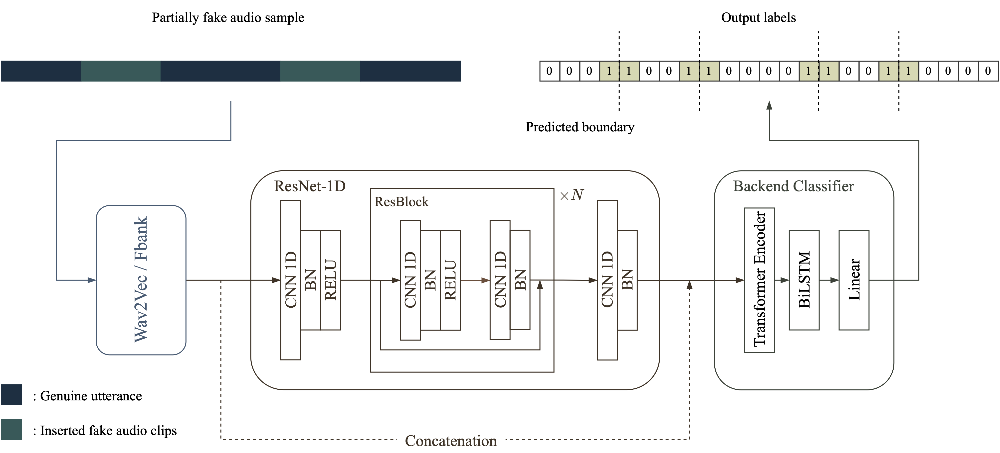
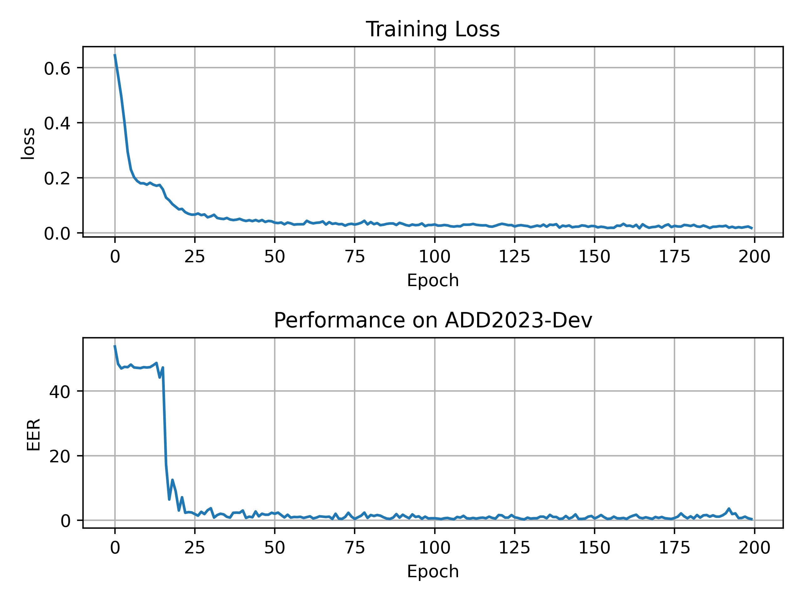

# WAVEFORM BOUNDARY DETECTION SYSTEM

This is a PyTorch implementation of our proposed frame-level boundary detection system as introduced in the paper ["Waveform Boundary Detection for Partially Spoofed Audio"](https://ieeexplore.ieee.org/document/10094774). Please note that this implementation is based on the ADD-2023 dataset, as it already contains partially spoofed utterances. Therefore, it would be ideal if you have access to the ADD-2023 dataset. However, if you do not have access to the ADD-2023 dataset, don't worry! You can still use the code with the ADD-2022 dataset following ADD-2023's label format. 
## Citation
```
@INPROCEEDINGS{cai2023wavform,
  author={Cai, Zexin and Wang, Weiqing and Li, Ming},
  booktitle={2023 IEEE International Conference on Acoustics, Speech and Signal Processing}, 
  title={Waveform Boundary Detection for Partially Spoofed Audio}, 
  pages={1-5}}

```

# Model Architecture



---

# Tutorials
### Installation 
This project is based on the open-source speech toolkit [SpeechBrain](https://github.com/speechbrain/speechbrain), please refer to the installation commands of SpeechBrain.

```shell
git clone https://github.com/caizexin/speechbrain_PartialFake.git
cd speechbrain_PartialFake
pip install -r requirements.txt
# you can also create the same conda environment with our provided file environment.yml
# conda env create -f environment.yml
pip install --editable .
```

### Model Training
All hyperparameters can be specified in the training file "[train_wav2vec_melnet_bdr.yaml](https://github.com/caizexin/speechbrain_PartialFake/blob/main/ADD_2023/hparams/train_wav2vec_melnet_bdr.yaml)" The [training dataset](https://github.com/caizexin/speechbrain_PartialFake/tree/main/ADD_2023/add_data/ADD2023_Track2_train) directory is shown below, where the "wav" folder contains the training utterances, and "[label.txt](https://github.com/caizexin/speechbrain_PartialFake/blob/main/ADD_2023/add_data/ADD2023_Track2_train/label.txt)" has the corresponding labels in a specific format. The "wav" folder isn't shown in this repository since there are no file in it.
```
├── wav
│   ├── ADD2023_T2_T_00000001.wav
│   ├── ADD2023_T2_T_00000002.wav
│   ├── ADD2023_T2_T_00000001.wav
│   ├── *.wav
└── label.txt
```
The labeling format is shown below:
```
[uttname begin(s)-end(s)-authenticity(T for genuine and F for fake) utt-authenticity]
ADD2023_T2_T_00000001 0.00-4.72-T 1
ADD2023_T2_T_00000002 0.00-1.62-T/1.62-2.48-F 0
ADD2023_T2_T_00000003 0.00-1.25-T/1.25-1.80-F/1.80-4.53-T 0
```

Download [RIRS_NOISES](https://www.openslr.org/28/) and [MUSAN](https://www.openslr.org/17/), and change the [corresponding path](https://github.com/caizexin/speechbrain_PartialFake/blob/01129d9246144328e941d1bf0278e6ef3c8ad817/ADD_2023/hparams/train_wav2vec_melnet_bdr.yaml#L59) in the yaml file.

Download pre-training model [wav2vec2-base-960h](https://huggingface.co/facebook/wav2vec2-base-960h), and change [the corresponding model path](https://github.com/caizexin/speechbrain_PartialFake/blob/01129d9246144328e941d1bf0278e6ef3c8ad817/ADD_2023/hparams/train_wav2vec_melnet_bdr.yaml#L156) in the yaml file. This example is based on acoustic feature extracted by wav2vec2-base-960h.

```shell
cd ADD_2023

# single gpu
nohup python train_wav2vec_melnet_bdr.py hparams/train_wav2vec_melnet_bdr.yaml --find_unused_parameters > log/train_wav2vec_melnet_bdr.log &

# multi-gpus
CUDA_VISIBLE_DEVICES=0,1,2,3,4,5,6,7 nohup python -m torch.distributed.launch --nproc_per_node=8 train_wav2vec_melnet_bdr.py hparams/train_wav2vec_melnet_bdr.yaml --distributed_launch --distributed_backend='nccl' --find_unused_parameters > log/train_wav2vec_melnet_bdr.log &

```




### Inference

```shell
CUDA_VISIBLE_DEVICES=0 nohup python infer_wav2vec_melnet_bdr.py hparams/infer_wav2vec_melnet_bdr.yaml > log/infer_wav2vec_melnet_bdr_ADD2022Test.log &
```
### Performance (EER)
| ADD2023-Dev | [ADD2022-Test](https://codalab.lisn.upsaclay.fr/competitions/4111) (BlueDevil) |
|-------------|--------------|
|    0.47%    |    10.16%     |

### Pre-trained checkpoints
[Google Drive](https://drive.google.com/file/d/1Ung_DQMikwBmFxokmSrPq7lSnohctRNm/view?usp=share_link)

#### Generally, larger pre-training model lead to better performance, our best performance on ADD2022-Test is 4.59%, achieved by a model trained on ADD-2023.
---

# References and Resources

* [SpeechBrain](https://github.com/speechbrain/speechbrain)
* [Audio Deep Synthesis Detection (ADD Challenge) ](http://addchallenge.cn)
* [ADD 2022 - Partially fake audio detection](https://codalab.lisn.upsaclay.fr/competitions/4111) [Team name: BlueDevil]


